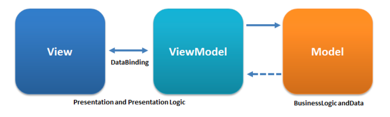

The BLoC pattern is a state management strategy which emphasizes isolation between the business logic of your application, and the rendering and styling.

<center>
    
</center>

The original pattern was designed for Dart by the Google Adwords where they leveraged the separation of view logic form business logic in an effort to reuse large portions of the codebase across their AngularDart webapp, and their Flutter mobile app.


```tsx
import React from 'react';
import { useMemo } from 'react';
import { createTodoBloc } from './TodoBloc';
import { Observer, changeValue } from '../../src/utils';

export function App() {
  const bloc = useMemo(() => createTodoBloc(localStorage), []);

  return (
    <div className="container" style={{ marginTop: '10vh', width: '30em' }}>
      <h1>Todos</h1>
      <ul className="list-group">
        <Observer
          of={bloc.todos}
          next={todos =>
            todos.map(todo => (
              <li
                key={todo.id}
                style={{ textDecoration: todo.done ? 'strike' : 'none' }}
                className="list-group-item"
                onClick={() => bloc.toggleTodo(todo.id)}
              >
                {todo.label}&nbsp;
                <a href="#" className="float-right" onClick={() => bloc.deleteTodo(todo.id)}>
                  Delete
                </a>
              </li>
            ))
          }
        />
      </ul>
      <br />
      <form
        onSubmit={evt => {
          bloc.saveTodo();
          // UI specific logic belongs in view code
          evt.preventDefault();
        }}
        className="form"
      >
        <label htmlFor="new-todo-label">New Todo</label>
        <div className="input-group">
          <Observer
            of={bloc.newTodoLabel}
            next={value => (
              <>
                <input
                  id="new-todo-label"
                  type="text"
                  className="form-control"
                  placeholder="Todo title"
                  value={value}
                  onChange={changeValue(bloc.changeNewTodoLabel)}
                />
              </>
            )}
          />
          <div className="input-group-append">
            <button type="submit" className="btn btn-primary">
              Add
            </button>
          </div>
        </div>
      </form>
    </div>
  );
}
```

```ts
import { BehaviorSubject, combineLatest, Observable } from 'rxjs';
import { debounceTime } from 'rxjs/operators';

export interface TodoBloc {
  todos: Observable<Todo[]>;
  newTodoLabel: Observable<string>;
  changeNewTodoLabel(label: string): void;
  saveTodo(): void;
  toggleTodo(todoId: string): void;
  deleteTodo(todoId: string): void;
}

type Todo = {
  label: string;
  id: string;
  done: boolean;
};

type SaveState = {
  todos: Todo[];
  newTodoLabel: string;
};

export function createTodoBloc(storage: Storage): TodoBloc {
  const savedState = getSave(storage);
  const todos = new BehaviorSubject(savedState.todos);
  const newTodoLabel = new BehaviorSubject(savedState.newTodoLabel);

  // anytime the source todos are updated, let's save to storage
  combineLatest(todos, newTodoLabel)
    // debouce after a half second
    .pipe(debounceTime(500))
    .subscribe(([todos, newTodoLabel]) =>
      saveState(storage, { todos, newTodoLabel })
    );

  return {
    toggleTodo(todoId: string) {
      todos.next(
        todos.value.map(originalTodo => {
          if (originalTodo.id === todoId) {
            // flip todo item
            return {
              ...originalTodo,
              done: !originalTodo.done,
            };
          } else {
            return originalTodo;
          }
        })
      );
    },
    deleteTodo(todoId: string) {
      todos.next(
        todos.value.filter(originalTodo => {
          // filter out todo
          return originalTodo.id !== todoId;
        })
      );
    },
    changeNewTodoLabel(label: string) {
      newTodoLabel.next(label);
    },
    saveTodo() {
      todos.next([
        ...todos.value,
        { id: randId(), done: false, label: newTodoLabel.value },
      ]);
      newTodoLabel.next('');
    },
    newTodoLabel,
    todos,
  };
}

const randId = () =>
  Math.random()
    .toString(36)
    .slice(2);

const STORAGE_KEY = 'todos';

function getSave(storage: Storage): SaveState {
  return (
    JSON.parse(storage.getItem(STORAGE_KEY) || 'false') || {
      newTodoLabel: '',
      todos: [],
    }
  );
}

function saveState(storage: Storage, todos: SaveState) {
  return storage.setItem(STORAGE_KEY, JSON.stringify(todos));
}

```



Here, you can see a demo of the app running.

============


<iframe src="/storybook/iframe.html?id=todos--todo-app-observer" height="500" style="border: none"></iframe>


