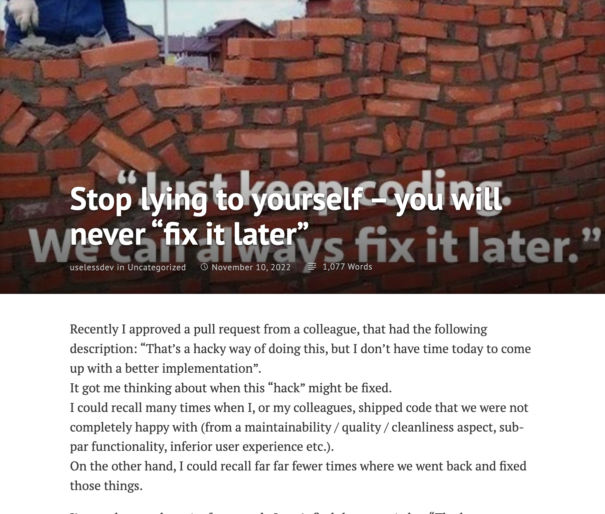

# How to "fix it later" when later is 6 months from now or never.

**RE: [Stop lying to yourself – you will never "fix it later"](https://uselessdevblog.wordpress.com/2022/11/10/stop-lying-to-yourself-you-will-never-fix-it-later/)**

I've been on 

Read the <a href="https://uselessdevblog.wordpress.com/2022/11/10/stop-lying-to-yourself-you-will-never-fix-it-later/">original article</a> ([web.archive.org](https://web.archive.org/web/20221116101813/https://uselessdevblog.wordpress.com/2022/11/10/stop-lying-to-yourself-you-will-never-fix-it-later/)) and [original Reddit thread](https://www.reddit.com/r/programming/comments/yv0zy5/stop_lying_to_yourself_you_will_never_fix_it_later/) for more thoughts.

